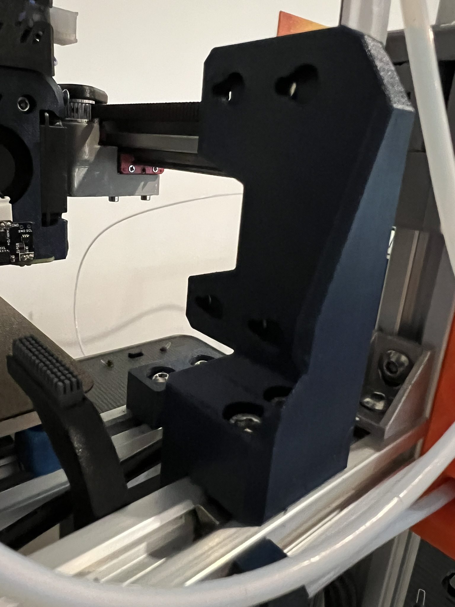
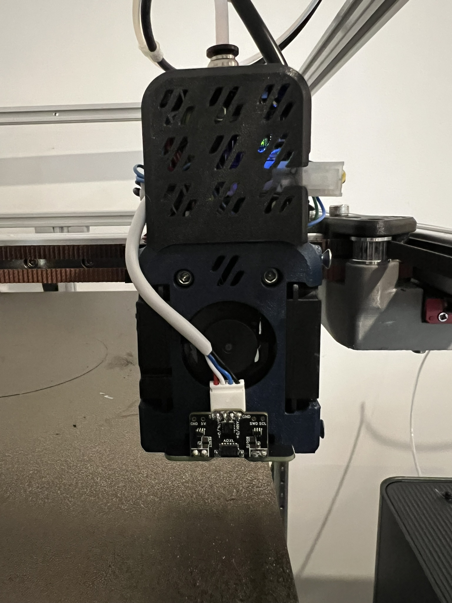

Dock based on Ambrosia that can be mounted to a horizontal extrusion on a Trident or similar.

DragonBurner shroud with modification to allow a cartographer to be mounted using the 90 degree variant.
Optimised for CHC Pro hot ends. The dock has a cutout for clearance of the carto.

